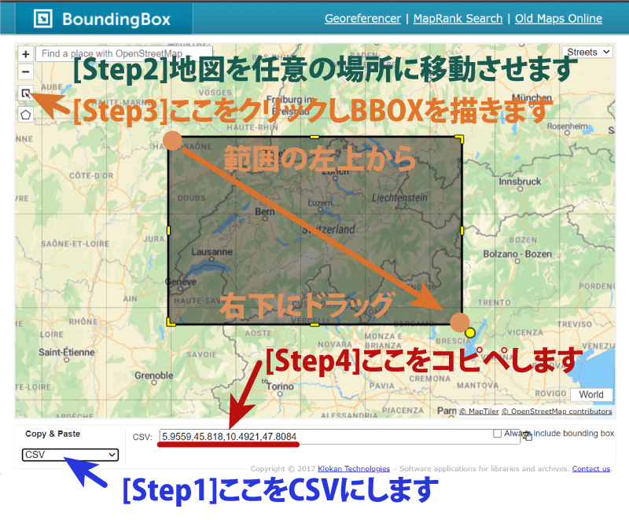

# bbox2heatmap

## Usage

### 対話型実行例

対話型で実行します。情報科学概論の講義で利用する場合はこの方法を使ってください。

```
npx -y -p bbox2heatmap@latest run
```
* 上記のコマンドを打つと以下のプロンプトが表示されるので、kibacoで通知されたパスワードを入力してください。
```
? パスワードを入力してください »
```
* 次に集める画像の範囲指定(BBOX)が求められます。西,南,東,北の順で緯度経度を指定します。
     * BBOXは次のページを使うと簡単に求められます：https://boundingbox.klokantech.com/
     * 使い方はこちら
         * 
```
? 検索範囲(BBOX)をカンマ区切り入力してください。 » 
```
* 最後に検索する画像をハッシュタグで限定します。集めたい写真のハッシュタグを入力してください。(例：dog,catなど・・・)
```
? 検索タグを入力してください。全ての写真を集める場合はそのままEnterを押してください。 »
```
* これで写真をFlickrから収集し始めます。20000枚集めた時点で自動終了しますが、Ctrl+Cを押すことで途中終了も可能です。終了するとブラウザが立ち上がりヒートマップが標示されます。情報科学概論受講生はスクリーンショット等で保存し発表会資料としてください。
* 20000毎以上集めたい時はコマンドにサイズオプションを指定してください。ただし、この数に関わらず指定されたハッシュタグの写真を集め終えた時点でプログラムは終了します。
```
npx -y -p bbox2heatmap@latest run --max=50000
```

### コマンド型実行例

* WSLやSSHなど、自動的にブラウザを立ち上げる事が出来ない場合は、コマンド型で実行してください。

```
npx -y -p bbox2heatmap@latest run --bbox=<範囲> --search=<タグ> --max=<集めたい写真の数> --portable
```
* ***bbox***: ジオタグ付き写真を集める検索範囲を入力してください。以下のサイトで得られます。
    * https://boundingbox.klokantech.com/
    * 
* ***タグ***: ここで指定されたタグの付いた写真のみを収集します。(省略すると全写真)
* ***集めたい写真の数***: (整数) 数が多ければ多いほど検索に時間がかかります。10000～20000ぐらいが良いでしょう。(省略すると20000枚集めます)
* **--portable**: これが付いていると、Webブラウザを立ち上げる代わりに、結果のHTMLファイルを出力します。WSLやSSH等、Webブラウザの使えない環境で利用してください。
    * 実行が終わると最終行に以下のように、結果可視化のためのHTMLファイルのパスが表示されるので、このファイル(index.html)を、エクスプローラーやファインダーで探し、Webブラウザに読み込みます。

```
Open C:\Users\　～省略～　\index.html
```

## Examples（コマンド型）

### Example1 (BBOX)
#### Heatmap of Disneyland
```(sh)
npx -y -p bbox2heatmap@latest run --bbox=-117.928104,33.8034,-117.915487,33.81802 --max=10000 --portable
```


##Example2 (BBOX and Tag)
Who drinks the most beer, wine, and whisky in Europe?

#### Heatmap Whisky in Europe
```(sh)
npx -y -p bbox2heatmap@latest run --bbox=-19.69,36.03,26.37,59.18 --search=whisky --max=10000 --portable
```


#### Heatmap of Wine in Europe
```(sh)
npx -y -p bbox2heatmap@latest run --bbox=-19.69,36.03,26.37,59.18 --search=wine --max=10000 --portable
```


#### Heatmap of Beer inEurope
```(sh)
npx -y -p bbox2heatmap@latest run --bbox=-19.69,36.03,26.37,59.18 --search=beer --max=10000 --portable
```

